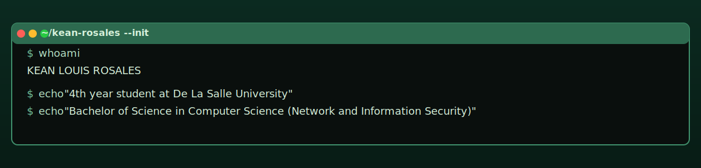
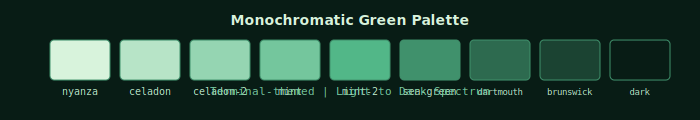

# 

<div align="center">

[](https://git.io/typing-svg)

[](https://keanrosales.com)
[](https://keanrosales.com/resume.pdf)
[](mailto:kean@keanrosales.com)

</div>

---

## $ whoami

```bash
kean@portfolio:~$ cat about.txt
```

```
KEAN LOUIS ROSALES

4th year student at De La Salle University
Bachelor of Science in Computer Science
Major in Network and Information Security

Location: Metro Manila, Philippines
Specialization: Cybersecurity & Full-Stack Development
Competitions: 8+ Hackathons | 100% Award Rate
Recent: DLSU HackerCup 2025 Champion, Inventi Hackathon 2nd Place

STATUS: Available for collaboration
```

---

<details>
<summary>Competition Achievements</summary>

```bash
kean@portfolio:~$ sort -k2 -nr hackathons.log | head -10
```

| RANK | COMPETITION | PROJECT | ACHIEVEMENT | YEAR |
|------|-------------|---------|-------------|------|
|  | DLSU HackerCup | KitaKita |  | 2025 |
|  | Inventi Hackathon Challenge | InventiSolve |  | 2025 |
|  | DLSU CTF | Cybersecurity Competition |  | 2025 |
|  | DLSU CTF | Cybersecurity Competition |  | 2024 |
|  | Tenext.ai Codebreak 2.0 | Neosolutions |  | 2024 |
|  | FlutterFlow Manila Hackathon | Procrash |  | 2024 |
|  | SpringBoards hack-it | Kachingko |  | 2024 |
|  | KMC Solutions Hackathon | Talento |  | 2024 |

**Stats**: 8+ Competitions • 3 Champions • 7 Top 5 Finishes • 100% Award Rate

</details>

---

<details>
<summary>Featured Projects</summary>

```bash
kean@portfolio:~$ ls -la projects/ | grep -E "(champion|winner|finalist)"
```

### KitaKita — DLSU HackerCup 2025 Champion
> Messenger-based POS system for small neighborhood stores  
> **Stack**: Facebook Messenger API, Node.js, Express, MongoDB  
> **Impact**: Champion-winning solution for SME digitalization

### InventiSolve — Inventi Hackathon 2nd Place
> All-in-one property management solution for tenants and homeowners  
> **Stack**: React, Node.js, Express, PostgreSQL, JWT Authentication  
> **Impact**: Streamlined property operations and management

### Neosolutions — Top 5 Finalist
> Custom ticketing and support system for enterprise needs  
> **Stack**: React, Node.js, Socket.io, PostgreSQL  
> **Impact**: Real-time ticket management with workflow automation

### Procrash — 3rd Place Winner
> Gamified to-do list mobile app with RPG elements  
> **Stack**: Flutter, FlutterFlow, Firebase, Dart  
> **Impact**: Combating procrastination through gamification

### FiMO Communication Glove — Regional Science Fair Winner
> Smart glove translating finger movements into speech  
> **Stack**: Arduino, ML, Text-to-Speech AI, Gesture Recognition  
> **Impact**: Assistive technology for speech-impaired patients

</details>

---

<details>
<summary>Tech Stack</summary>

```bash
kean@portfolio:~$ cat portfolio/skills.txt
```

### **Programming Languages**


### **Frontend Development**


### **Backend Development**


### **Mobile Development**


### **Cybersecurity**


### **Hardware & IoT**


</details>

---

<details>
<summary>Design System</summary>



### **Terminal Aesthetic**
- **Theme**: Cyberpunk hacker terminal with Matrix-style elements
- **Typography**: Monospace fonts (JetBrains Mono, Fira Code)
- **Animations**: Boot sequences, glitch effects, scroll-triggered reveals
- **Interactions**: Full terminal command system with file navigation

```css
/* Core Color Variables */
--nyanza: #d8f3dcff;           /* Primary text */
--celadon: #b7e4c7ff;         /* Secondary text */  
--mint: #74c69dff;            /* Accent color */
--sea-green: #40916cff;       /* Borders & emphasis */
--dartmouth-green: #2d6a4fff; /* Backgrounds */
--brunswick-green: #1b4332ff; /* Card backgrounds */
--dark-green: #081c15ff;      /* Main background */
```

</details>

---

<details>
<summary>GitHub Stats</summary>

<div align="center">


</div>

</details>

---

## Connect

```bash
kean@portfolio:~$ cat contact.txt
```

<div align="center">

[](https://keanrosales.com)
[](https://keanrosales.com/resume.pdf)
[](mailto:kean@keanrosales.com)
[](https://linkedin.com/in/keanrosales)

</div>

---

<div align="center">

```bash
kean@portfolio:~$ echo "Built with React + CSS animations • Terminal aesthetic • Monochrome green"
```

**Built with React + CSS animations • Terminal aesthetic • Monochrome green**

[](https://github.com/keanlouis30)

</div>
